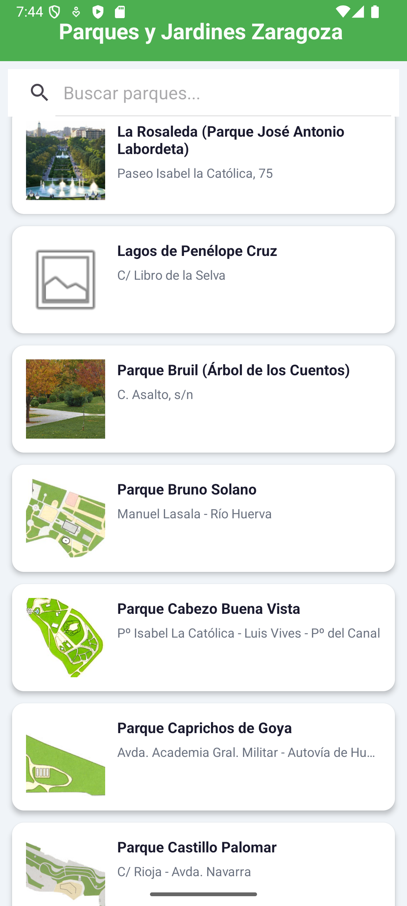
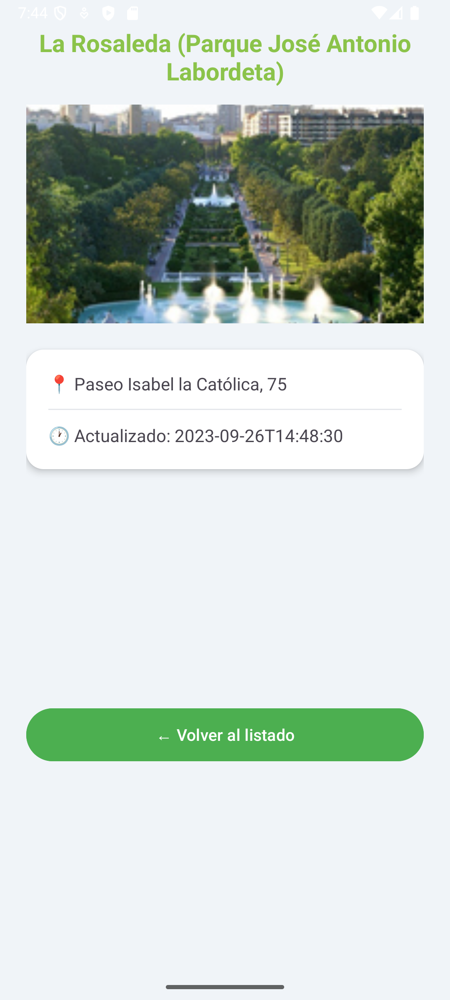

# Ejercicio 5 — Parques y Jardines de Zaragoza

**Módulo:** Programación Multimedia y Dispositivos Móviles (PMDM)  
**Entorno:** Android Studio Otter 2023.1.1 · Kotlin · API 24+

---

## Descripción

Aplicación Android que descarga el listado de **parques y jardines de Zaragoza**
desde la API del Ayuntamiento y los muestra en una lista con imagen, nombre y
dirección. Al pulsar sobre un parque se abre una pantalla de detalle con su
imagen completa, dirección y fecha de actualización. Incluye buscador en tiempo
real y opción de recargar deslizando hacia abajo (pull to refresh).

---

## Capturas de pantalla

| Listado | Buscador                                  | Detalle                                   |
|---|-------------------------------------------|-------------------------------------------|
|  |  |  |

> 📸 Copia tus capturas en la carpeta `screenshots/` con los nombres indicados

---

## API utilizada: Datos Abiertos Ayuntamiento de Zaragoza

### Endpoint

GET https://www.zaragoza.es/sede/servicio/equipamiento/category/820.json

### Por qué esta API

| Criterio | Detalle |
|---|---|
| **Oficial** | Publicada por el Ayuntamiento de Zaragoza en su portal de datos abiertos |
| **Sin registro** | No requiere API key ni autenticación |
| **Formato JSON** | Respuesta estructurada, fácil de parsear con Gson |

### Estructura de la respuesta

```json
{
  "id": 820,
  "title": "Parques y Jardines",
  "equipamiento": [
    {
      "id": 9258,
      "title": "Parque Bruil",
      "calle": "C. Asalto, s/n",
      "imagen": "//www.zaragoza.es/cont/paginas/medioambiente/parques/img/bruil.jpg",
      "lastUpdated": "2024-03-15T15:02:36"
    }
  ]
}
```

> La lista `equipamiento` está directamente en la raíz — solo necesita
> una clase wrapper (`ParqueResponse`).

> **Nota importante:** Las URLs de las imágenes usan protocolo relativo
> (`//www.zaragoza.es/...`). Hay que añadir `https:` antes de cargarlas con Picasso:
> ```kotlin
> val urlCompleta = if (imagen.startsWith("//")) "https:$imagen" else imagen
> ```

---

## Tecnologías utilizadas

### Retrofit

```kotlin
interface JardinesApiService {
    @GET("sede/servicio/equipamiento/category/820.json")
    suspend fun getParques(
        @Query("rows") rows: Int = 10000
    ): ParqueResponse
}
```

### Gson

```kotlin
data class Parque(
    val id: Int = 0,
    @SerializedName("title") val titulo: String = "",
    val calle: String = "",
    val imagen: String = "",
    val lastUpdated: String = ""
)

data class ParqueResponse(
    @SerializedName("equipamiento")
    val equipamiento: List<Parque> = emptyList()
)
```

### RecyclerView + Adapter con buscador

El Adapter gestiona dos listas para el buscador en tiempo real:

```kotlin
private var listaCompleta: List<Parque> = emptyList()
private var listaFiltrada: List<Parque> = emptyList()

fun filtrar(texto: String) {
    listaFiltrada = if (texto.isEmpty()) listaCompleta
    else listaCompleta.filter { it.titulo.contains(texto, ignoreCase = true) }
    notifyDataSetChanged()
}
```

### Picasso

```kotlin
val urlCompleta = if (parque.imagen.startsWith("//")) "https:${parque.imagen}" else parque.imagen
Picasso.get()
    .load(urlCompleta)
    .placeholder(android.R.drawable.ic_menu_gallery)
    .error(android.R.drawable.ic_menu_close_clear_cancel)
    .fit()
    .centerCrop()
    .into(binding.ivJardines)
```

### Kotlin Coroutines

```kotlin
scope.launch {
    val response = withContext(Dispatchers.IO) {
        RetrofitClient.apiService.getParques()
    }
    showParques(response.equipamiento)
}
```

### SwipeRefreshLayout

```kotlin
binding.swipeRefresh.setOnRefreshListener {
    cargarDatos()
}
// En el bloque finally:
binding.swipeRefresh.isRefreshing = false
```

### View Binding

```kotlin
binding = ActivityMainBinding.inflate(layoutInflater)
setContentView(binding.root)
```

---

## Configuración de red

La API usa HTTPS pero las imágenes usan URLs con protocolo relativo.
Se añade `network_security_config.xml` por precaución:

```xml
<network-security-config>
    <domain-config cleartextTrafficPermitted="true">
        <domain includeSubdomains="true">www.zaragoza.es</domain>
    </domain-config>
</network-security-config>
```

---

## Funcionalidades

- ✅ Listado de parques con imagen, nombre y dirección
- ✅ Buscador en tiempo real por nombre
- ✅ Pull to refresh para recargar
- ✅ Pantalla de detalle con imagen completa y dirección
- ✅ Manejo de errores de red
- ✅ View Binding en todas las pantallas

---

## Estructura del proyecto
Jardines/
├── app/src/main/
│   ├── java/com/example/jardines/
│   │   ├── model/
│   │   │   ├── Parque.kt
│   │   │   └── ParqueResponse.kt
│   │   ├── network/
│   │   │   ├── JardinesApiService.kt
│   │   │   └── RetrofitClient.kt
│   │   ├── JardinesAdapter.kt
│   │   ├── MainActivity.kt
│   │   └── DetailActivity.kt
│   ├── res/
│   │   ├── layout/
│   │   │   ├── activity_main.xml
│   │   │   ├── activity_detail.xml
│   │   │   └── item_jardines.xml
│   │   └── xml/
│   │       └── network_security_config.xml
│   └── AndroidManifest.xml
├── screenshots/
│   ├── 01_listado.png
│   ├── 02_buscador.png
│   └── 03_detalle.png
└── README.md

---

## Autor

Pedro M. Avilés Aguilera — 2.º DAM · IES Portada Alta, Málaga  
FCT: Constella Intelligence, Granada